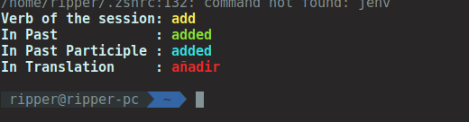

# SudoVerb

Inspired on [badarsh2/Sudocabulary](https://github.com/badarsh2/Sudocabulary)

This show a english ver with its conjugation and translations in your console.

## Installing

You can install it with
`\curl -sSL https://raw.githubusercontent.com/ricardo-pcan/SudoVerbs/master/script.sh | bash`

